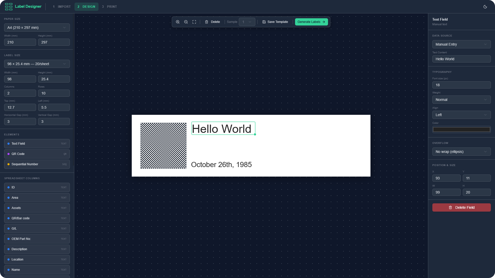

<p align="center">
  <a href="https://label-designer.net">
    
  </a>
</p>

<p align="center">
  Design and print labels from spreadsheet data — entirely in your browser.
</p>

<p align="center">
  <a href="https://label-designer.net"><strong>Website</strong></a> · <a href="#features"><strong>Features</strong></a> · <a href="#getting-started"><strong>Getting Started</strong></a> · <a href="#usage"><strong>Usage</strong></a> · <a href="https://github.com/Edward/label-designer/issues"><strong>Issues</strong></a>
</p>

<p align="center">
  <a href="LICENCE.md"></a>
  
  
  
</p>

<br />

<p align="center">
  <a href="https://label-designer.net">
    
  </a>
</p>


## What is Label Designer?

Label Designer is a **privacy-first** web app for creating and printing labels from spreadsheet data. Import a `.csv` or `.xlsx` file, lay out your labels with text, QR codes, or sequential numbers on a visual canvas, then print — all without your data ever leaving the browser. No servers, no uploads, no tracking.

**Try it now at [label-designer.net](https://label-designer.net)** - no install required!

## Features

**Spreadsheet Import** — Drag-and-drop `.csv`, `.xlsx`, or `.xls` files with automatic column detection and multi-sheet support

**Visual Label Editor** — Position and resize elements on a live-preview canvas with zoom controls and keyboard shortcuts

**Flexible Layout** — Paper presets (A3, A4, A5, Letter, Legal) or custom dimensions, with configurable rows, columns, margins, and gaps

**Dynamic Elements** — Map spreadsheet columns to text or QR code elements, add static text, or use auto-incrementing sequential numbers

**Template System** — Save, load, import, and export label designs as reusable templates

**Print-Ready Output** — Generates paginated label sheets with print-optimized styles for your browser's print dialog

**Privacy First** — Everything runs client-side. No server, no uploads, no tracking

## Getting Started

### Prerequisites

- [Bun](https://bun.sh), [Node.js](https://nodejs.org), or [pnpm](https://pnpm.io)

### Install & Run

```bash
# Clone the repository
git clone https://github.com/Edward/label-designer.git
cd label-designer

# Install dependencies
bun install

# Start the dev server
bun run dev
```

Open [http://localhost:5173](http://localhost:5173) and you're ready to go.

> **Using npm or pnpm?** Replace `bun` with your preferred package manager — everything works the same.

## Usage

Label Designer follows a simple three-step workflow:

### 1. Import

Upload a spreadsheet file (`.csv`, `.xlsx`, `.xls`) on the home page. Columns are detected automatically, and you can switch between sheets if your file has multiple.

### 2. Design

Configure your paper and label dimensions, then add elements to the canvas:

- **Text** — Mapped to spreadsheet columns or static content, with font size, weight, alignment, and color options
- **QR Codes** — Generated from column data or manual input
- **Sequential Numbers** — Auto-incrementing with configurable start, step, padding, prefix, and suffix

Drag, resize, and fine-tune each field with precise controls. Save your layout as a template to reuse later.

### 3. Print

Preview the generated label sheets and print directly from your browser. Labels are positioned with millimeter precision and optimized for clean output.

## Building

```bash
bun run build
```

Produces a static site in `build/` that can be deployed to any static host (Vercel, Netlify, Cloudflare Pages, GitHub Pages, etc.).

```bash
# Preview the production build locally
bun run preview
```

## Contributing

Contributions are welcome! Here's how you can help:

- **Bug reports** — [Open an issue](https://github.com/Edward/label-designer/issues) with steps to reproduce
- **Feature requests** — Share ideas in [Issues](https://github.com/Edward/label-designer/issues)
- **Pull requests** — Fork, create a branch, and submit a PR

## License

MIT License — see [LICENCE](LICENCE.md) for details.
